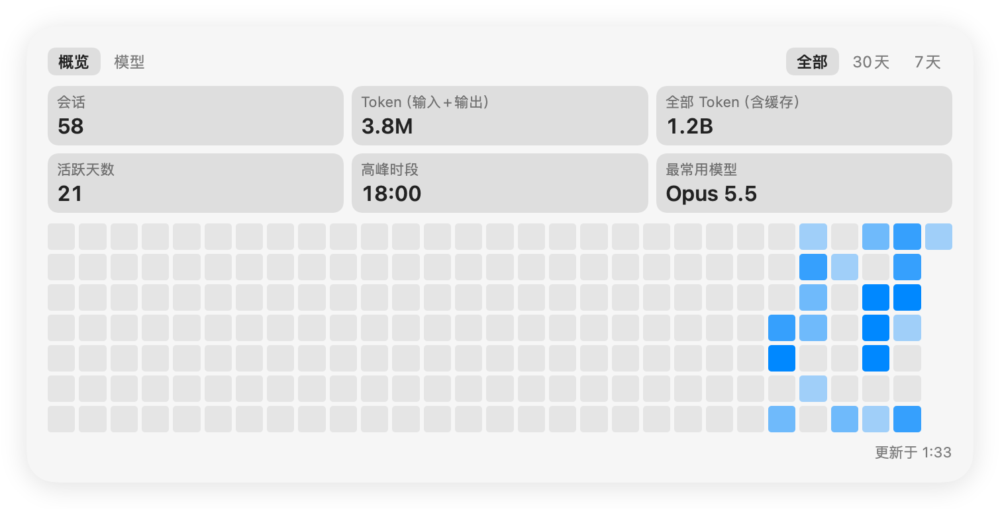
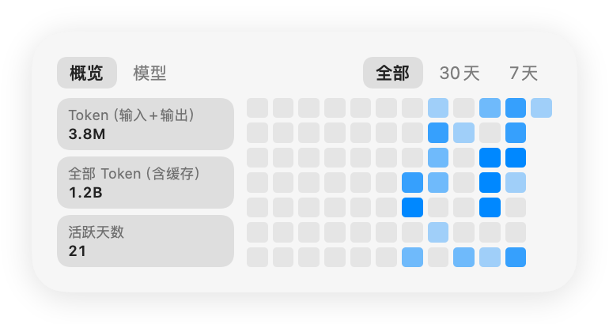
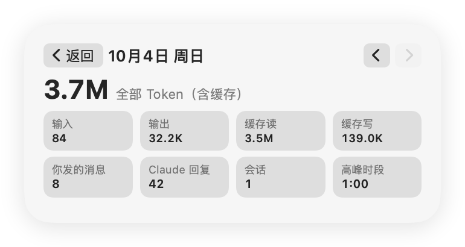
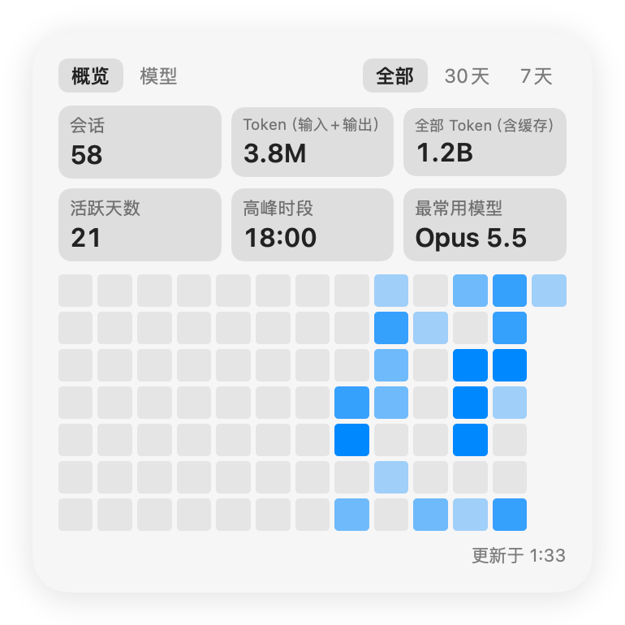
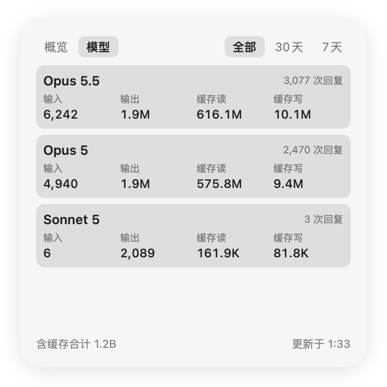
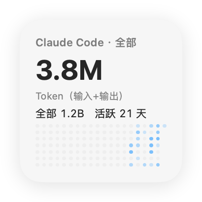
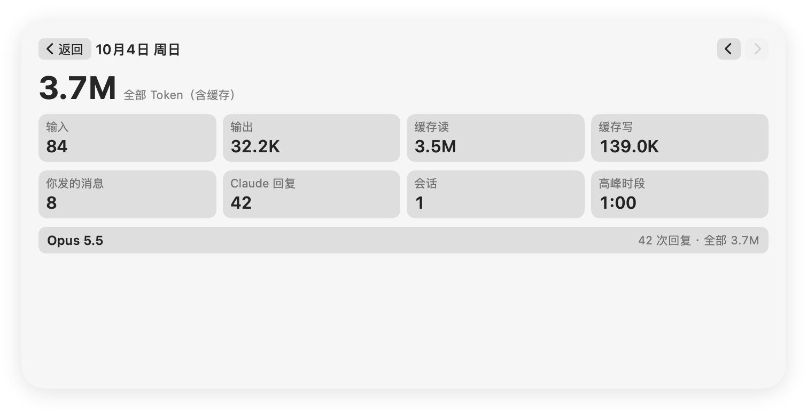

<p align="center"></p>

<h1 align="center">Claude Code Usage Widget</h1>

<p align="center">A native macOS desktop widget that shows your Claude Code CLI usage stats</p>

<p align="center"><a href="README.md">中文</a> · English</p>

<p align="center"></p>

## What it does

A WidgetKit desktop widget with a layout modeled on the usage panel in the Claude desktop app. All data comes from the Claude Code CLI session logs in `~/.claude/projects` on your Mac. Nothing goes over the network or gets uploaded.

> The widget UI is currently in Chinese only.

- **Overview**: sessions, tokens (input + output), all tokens (including cache), active days, peak hour, most-used model
- **Models**: input / output / cache read / cache write tokens per model
- **Time range**: all / 30 days / 7 days, tap to switch
- **Heatmap**: one cell per day, darker means more active
- **Day details**: tap a heatmap cell to open that day's page with all tokens, input / output / cache read / cache write, your messages, Claude replies, sessions, peak hour and per-model usage. "Back" in the top-left returns to the main view, and ◀ ▶ in the top-right moves between days
- **Four sizes**: small, medium, large, extra large

| Medium | Medium · day details |
|---|---|
|  |  |

| Large | Large · models | Small |
|---|---|---|
|  |  |  |

<p align="center"></p>

> Screenshots are rendered on a solid background. On the desktop, macOS adds its glass / tinted widget styling.

## How usage is counted

- **Claude Code CLI only**: the Code feature in the Claude desktop app also writes logs to `~/.claude/projects` (with `entrypoint` set to `claude-desktop`). Those are excluded.
- **Deduplicated per reply**: a single model reply is written as several lines, one per content block, and each line carries the same usage (about 2.2× duplication in practice). Usage is deduplicated by `message.id`, so the numbers are lower than a naive sum.
- **Tokens (input + output)** exclude cache. **All tokens** = input + output + cache read + cache write, and are mostly cache reads.
- **Sessions**: session files that contain a conversation. Subagent logs count toward tokens but not as separate sessions.
- **Active days / peak hour / heatmap**: local time zone, counting your messages plus model replies.
- The counting logic was cross-checked item by item against a standalone Python script.

## Install from source

Requires macOS 15+, Xcode and [XcodeGen](https://github.com/yonaskolb/XcodeGen) (`brew install xcodegen`).

```bash
git clone https://github.com/simony3/claude-code-usage-widget.git
cd claude-code-usage-widget
./build.sh install
```

The build uses ad-hoc signing, so no certificate is needed. Once installed, right-click the desktop → "Edit Widgets" → search for "Claude", then drag "Claude Code 用量小组件" onto the desktop.

After changing the code, run `./build.sh install` again.

## How it works

```
~/.claude/projects/**/*.jsonl
        │  scanned every 10 minutes, only changed files are re-parsed (incremental cache)
        ▼
ClaudeUsage.app (background, launches at login, no window)
        │  writes ~/Library/Application Support/ClaudeUsage/snapshot.json
        ▼
Widget extension (sandboxed, reads only that directory) ──► desktop
```

- No App Group: App Groups don't work without a provisioning profile, so the app writes to a plain directory and the widget reads it through a sandbox read-only exception.
- Debugging: `ClaudeUsage --dump` prints the stats, and `ClaudeUsage --render <dir>` renders screenshots of every size.

## Known limitations

- Claude Code keeps only 30 days of session logs by default, so "all" really covers about a month. To keep more, set `cleanupPeriodDays` in `~/.claude/settings.json`.
- macOS decides when widgets refresh, so data can lag by up to ten-odd minutes.
- Desktop widgets don't receive keyboard events, so days are switched with the ◀ ▶ buttons rather than arrow keys.
- Cells in the small size are too small to tap reliably, so tapping anywhere on the heatmap opens today's details first; use the arrows from there.

## Disclaimer

A personal open-source project, not affiliated with Anthropic and not an official product. Claude is a trademark of Anthropic.
